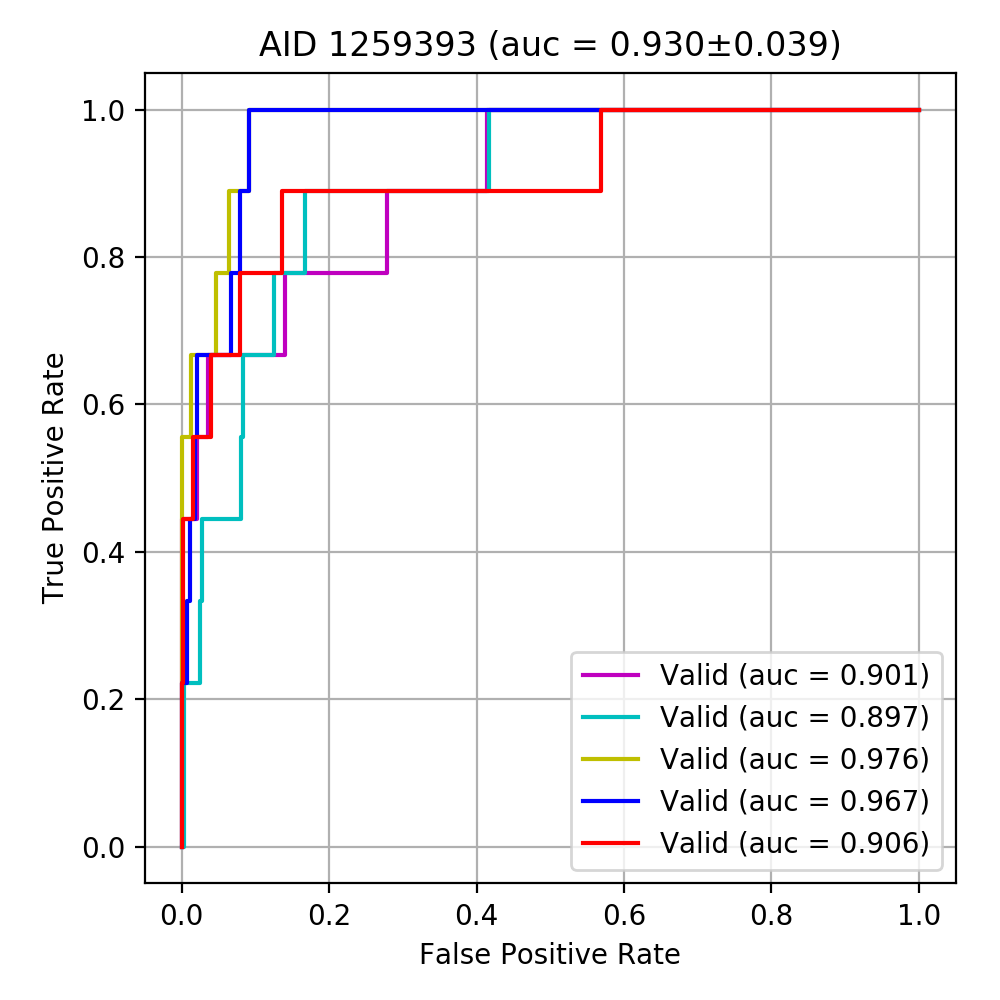

## ROC-AUCとは

普通AUCといえば、薬学生なら誰もが血中濃度曲線下面積を想像するだろう。  
しかし、同じArea Under Curveでも分類問題のときはROC-AUCというのをよくモデルの性能の評価指標として用いる。

## ROC曲線の意義と見方

ROC曲線は一言で言うと、分類モデルがサンプルを２つの群にどのくらいを重ねずに分けることができるかと言うことを示す。ここで言う**重なる**とはAともBともいえないような、どっちとも判別がつかない中間に位置するものを指す。

定義では、X軸に偽陽性率、Y軸に真陽性率をとり閾値を変えるとともに変化する点をプロットすることで得られる曲線である。

X軸は**1 - 特異度(Specificity)**、Y軸は**感度(Sensitivity)**と表されることが多い。

この曲線の下の面積を求めてそれが1に近いほど、２群間の分離度が高いと言うことで良いモデルと判断する。機械学習モデルの予測は、２値分類だとしてもその出力は*Probability*で算出する。つまり、どのくらい1のラベルに近いか、0のラベルに近いかと言うことをランク付けすると言うことだ。そのランクのうち、何番目までを1として何番目以降を0とするかを決めることで、1か0かに分類することができる。

そうすることで初めて、分割表が描け、感度や特異度が求められる。ROC-AUC曲線はいわばこの分割表の集合体であり、何番目までを1として何番目以降を0とする、その境界値、閾値(threshold, cutoff)を変えることで、描くことができる。

別の見方をすると、正解のラベルが1の数でY軸を分割し、正解のラベルが0の数でX軸を分割する。そして、(0, 0)から出発して、予測値を順番に並べて予測が1に近い方から順に、1のラベルを正しく1と予測できたらY方向に1マス進み、0のラベルを間違えて1と予測したら、X方向に1マス進むと言う風に描くとROC-AUCが書けると言う風にも捉えられる。

極端な話、１のラベルが１つしかなくその１つが最も１に近いですと予測できたならAUCは１、逆にどのラベルよりも１から遠いと予測したらAUCは０というだけの話だ。

また、上のグラフを見るとY軸方向への上昇幅が９分の１になっていることから、予測したラベルの中には９つしか１のラベルがなかったのだろうと大体の予測がつく。

一般的には、インバランスなデータでも正しく評価できるとされているが、1のラベルが特異的に判別しやすい1つしかないとき、それで本当に未知のデータに対する性能が測れるかと言われたら疑問である。

このへんの説明は難しすぎて、正直人に伝わる気がしない。
上手い説明の仕方をまた考えてみる。
