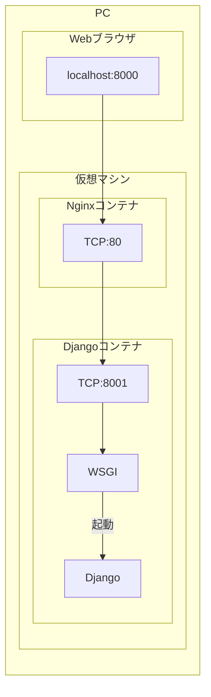

ただの落書き。

```dockerfile
FROM nginx:latest
```

こんなものを作ろうとしていた。



docker-compose使うときは

```conf
upstream django{
    server_name web:8001
}
```

みたいにして、django.webでEXPOSE 8001とかすればいいけど、そうじゃないときは`Nginx/conf.d/default.conf`に

```conf
location / {
    proxy_pass http://hoge
}
```

みたいにしてコンテナ起動時に

```shell
$ docker run --name django.nginx --link django.web:hoge -p 8000:80 -d django.nginx
```

ってすればいいのかな？

そうでもなさそう。

```conf
upstream api{
    server api.com
}
```

とかって書いたら、これは

```conf
server {
    location / {
        proxy_pass http://api;
    }
}
```

これでupstreamの記述にアクセス、すなわちapi.comにアクセスされるということ。このserverの書き方はIP:PORTなのはいいのだが、あ、django.webコンテナのportを確認すればいいのか。

IPアドレスは`exec -it hoge bash`とかでコンテナ内から

```shell
$ hostname -i
```

ってやるか

```shell
$ docker inspect django.web | grep IP
```

とかってすれば見られそう。

docker-composeを使う場合は、`compose up`の度に、新しくコンテナが立てられ、その度にIPアドレスが変わってしまうので、`docker-compose.yml`の中で定義したラベル？を用いて、

```conf
upstream hoge {
    server fuga:8001;
}

server {
    location / {
        proxy_pass http://hoge;
    }
}
```

のように書くことができる。コンテナのラベルから勝手にIPを取得できるというわけ。
