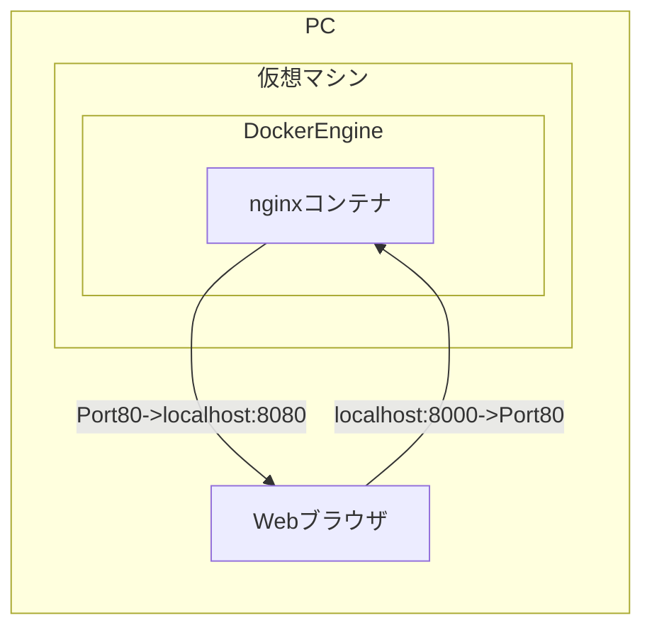
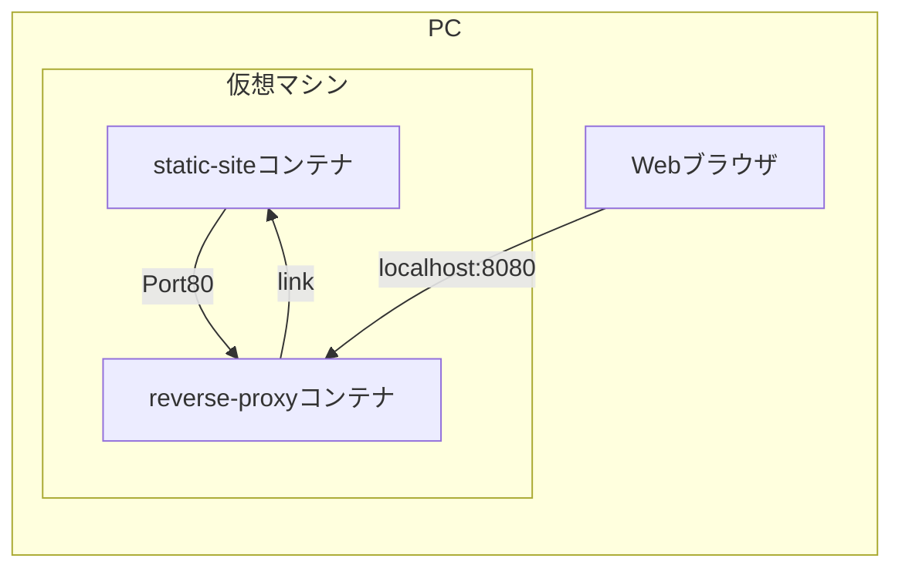

## Docker

docker に入門したときのメモ。

```shell
$ docker run hello-world
```

DockerHubからdockerイメージを取得して、ローカルに保存。のちにdockerイメージからコンテナを起動するコマンド。

> `run`コマンドは`pull`、`create`、`start`をまとめたもの

 ```shell
$ docker run -it ubuntu bash
 ```

タグ指定の方法

```shell
$ docker run hello-world:latest
```


Dockerイメージは読み取り専用らしい

イメージは軽量に作成する

CentOSのベースイメージにルビーのレイヤーを加えるとか、そんな感じに継承してレイヤーを追加していく。


```shell
$ docker run docker/whalesay cowsay Hello!!
```

これで、持っているイメージの一覧が取得できる。

```shell
$ docker images
```

イメージに任意の名前をつけることができる。

aliasみたいなもの

```shell
$ docker tag docker/whalesay my_whalesay:ver1
```

詳細情報を表示する

```shell
$ docker inspect my_whalesay
```

イメージを削除する(コンテナは起動したまま？)

```shell
$ docker rmi docker/whalesay
$ docker rmi -f docker/whalesay
```

> 同じ中身のイメージを複数削除するときは、ID指定するといい。
>
> ```shell
> $ docker rmi -f 9f5550ca0c41
> ```

また取得する

```shell
$ docker pull docker/whalesay
```

## imageを作成する

```shell
$ docker build -t docker-whale .
```

カレントディレクトリに存在する`Dockerfile`から`docker-whale`という名前でイメージを作成する。

```dockerfile
FROM docker/whalesay:latest↲
RUN apt-get -y update; apt-get install -y fortunes↲
CMD /usr/games/fortune | cowsay↲
```

[docker/whalesay](https://hub.docker.com/r/docker/whalesay)は`ubuntu:14.04`をベースイメージとして作成されているため、`apt-get`が使えるというわけ。

```shell
$ doker build --no-cache -t docker-whale .
```

## imageをDockerHubにあげる

GitHubみたいにssh通信ではなく、最初にログインする。

```shell
$ docker login
```

`DockerHub`アカウントのレポジトリ名と同じイメージ名にする。

```shell
$ docker tag docker-whale sasakipeter/docker-whale:latest
```

そうすると、`push`コマンドで単純にイメージ名を引数にとってあげれば、`DockerHub`上にあげることができる。

```shell
$ docker push sasakipeter/docker-whale:ver1
```

> いまだによくわかっていないこと
>
> ```shell
> $ docker ps
> ```
>
> 上のコマンドで、コンテナの一覧が見られるらしい。
>
> そのコンテナは、imagesから`create`コマンドで作成できるはずなのに、なぜかうまくいかない。
>
> `run`コマンドでしか、コンテナを起動できないのが現状。

## Nginxを使ったWebサーバーの構築

```shell
$ docker run --name test-nginx -d -p 8080:80 nginx
```

> `-d`オプションはdetach
>
> screenコマンドで見るやつと同じで、バックグランドで実行するということ。
>
> つまり、`screen`してから`yarn start`するのと同じ感覚

`localhost:8080`にnginxのサーバーが立ち上がっている。仮想マシンの8080にアクセスすると、nginxコンテナの80に転送されるらしい。



だいたいこんな感じ。

```shell
$ docker stop test-nginx
$ docker rm test-nginx
```

コンテナはストップしたら、`docker ps`には表示されないけれども、コンテナは存在している状態になる。removeしないと、同名のコンテナは作成できない。

> COPY命令がうんたんのところにも書いたけど、`--rm`オプションを使うことによって、コンテナ停止と同時に、コンテナを削除することができるらしい。
>
> コンテナ一括削除
>
> ```shell
> $ docker rm `docker ps -aq`
> ```
>
>

### バインドマウントを使用する

バインドマウント is なに？

自分のこのPC（ホスト）上のファイルと、仮想環境のLinuxの上に乗っかってるnginxをバインディングしてマウントしているってことやなきっと。

下のコマンドで`/usr/share/nginx/html`ってやって、バインド、すなわちファイルを転送しているけど、これは仮想環境上の場所（コンテナ内部）で、`cd`でアクセスしても見つからないことに注意。

```shell
$ docker run --name first-nginx -v /Users/sasakipeter/Documents/mycode/Study/Docker/docker-tutorial/html:/usr/share/nginx/html:ro -d -p 8080:80 nginx
```
> `-v`オプションはvolumeのvらしい。
> `ro`はread onlyの略

> Webサーバーって聞いて、Linuxサーバーとかそういうのを想像ちゃったけど、それは違くて、WebサーバーっていうのはApacheとかNginxとかそういうミドルウェアのことを言うんだなと気づいた。
>
> こいつらはHTTPリクエストを投げるとレスポンスを返すやつ。
>
> それすなわち、HTTPリクエストが来ると、ブラウザに静的なページを表示させたり、POSTを処理したりしているってこと。多分。
>
> 両者の大きな違いは、Apacheはマルチプロセスモデルで、メモリがすぐにいっぱいになりやすいけど、Nginxはシングルスレッドモデルで、イベントドリブンだから重い処理くると止まるけど、そうじゃなければほぼ同時に大量に捌ける。

### COPY命令ADD命令

```shell
$ docker run --name tmp-nginx --rm -d nginx
```

> この`--rm`オプションを使うことで、コンテナが停止した時に、コンテナの削除をしてくれる。

> ただの感想だけど、イメージからコンテナを作成するって聞いてたけど、どこからともなくコンテナ起動したりしてて、関連性がよくわからないな。
>
> って思ったけど、よくよく考えた毎回`run`コマンド使ってるし、その中でイメージからコンテナ作成しているんだろうなきっと。
>
> 今現状分からない、気になること
>
> * `create`コマンド、`start`コマンドを使って、純粋にdocker-whaleを実行したい。

コンテナ内にホスト上のファイルをコピーしたり、その逆をしたりすることができる。使い方は普通の`cp`コマンドとほぼ同じ。｀scp｀コマンドみたく、コンテナの名前を頭につけて`:`でつなぐだけ。

```shell
$ docker cp tmp-nginx:/etc/nginx/conf.d/default.conf ./
```

このコンフィグファイルにはどのポートでnginxをlistenするかとか書いてある。
そのlistenの項目が80になっているのを8080に変更してDockerfileを作成する。

```dockerfile
FROM nginx:latest
COPY default.conf /etc/nginx/conf.d/default.conf
```

こうすれば、nginxの設定を変え、ポートが8080になったイメージを作成することができる。

```shell
$ docker build -t nginx:ver1 .
```

このDocker imageをもとに、コンテナを作成、起動する。

```shell
$ docker run --name web -p 8080:8080 --rm nginx:ver1
```

### コンテナのライフサイクル

```shell
$ docker create --name status-test -it alpine /bin/sh
```

`it`オプションはよく分からんが、ないとすぐにシェルが終了してしまうらしい。

`i`オプションは標準出力で渡すとかなんとか。

`pull`してないのでalpineイメージ持ってないからコンテナ作成できなくねって思うけど、勝手にpullし始めた。

**起動していないコンテナを見ることができた！！！**
```shell
$ docker ps -a
```

めっちゃコンテナでてきて焦るやつ←

```shell
$ docker start status-test
```

こうしてコンテナを起動すると、ステータスが`Up int minutes`みたいになる。

コンテナが作成されて使われていないときは`Created`になる。さらに、ポーズさせると`Paused`となる。

```shell
$ docker pause status-test
```

`unpause`コマンドで解除できる。

```shell
$ docker unpause status-test
```

`stop`コマンドでコンテナを停止させると、statusは`Exit`になる。

停止中のコンテナは`start`コマンドで再起動できる。

コンテナの削除は、コンテナを停止してから`rm`すればよく、停止が面倒なら`-f`で強制的に削除することもできる。

> 気づいたけど、コンテナ作成するとき、それは`create`以外にも`run`のときも、`--name`オプションでコンテナの名前を指定しないと、アンダースコアでつながれたよく分からない名前を勝手につけられる。なんなんだ、この名前は？

## コンテナのシェルへの接続

```shell
$ docker attach container
```

こうすれば、コンテナ内で作業できるはず。

デタッチは`ctrl + p` + `ctrl + q`すればいい。

また、コンテナ起動時に、`/bin/bash`を引数に投げることで、最初からアタッチした状態で、起動することができる。

```shell
$ docker exec -it　container /bin/bash
```

`exec`コマンド自体は、コンテナ内でコマンドを実行するコマンドらしい。

```shell
$ heroku run --app hoge ls
```

みたいなノリか？

こっちなら、exitで抜けても、コンテナは停止しないらしい。

`exec -it`して`exit`で抜けるか、`attach`して`ctrl + p q`で抜けるかってだけ。

どっちでも、デタッチしたことになって、コンテナは起動したままになる。

### テスト
```shell
$ docker run --name connect-test -it -d ubuntu /bin/bash
$ docker attach connect-test
$ docker exec -it connect-test /bin/bash
```

## Docker コミット

コンテナの状態からイメージを作成する。

```shell
$ docker commit
```

通常は`Dockerfile`を使ってイメージを作るのがいい。

何操作したかわからんから。

`docker history`コマンドっていうのがあるらしい。

```shell
$ docker history commit-test:ver2
```
みたいにすると、履歴が見られる。

### テスト

```shell
$ docker run --name commit-test -it -d --rm ubuntu /bin/bash
$ docker exec -it commit-test /bin/bash
$ cd tmp
$ dd if=/dev/zero of=tempfile bs=1M count=10
$ exit
$ docker commit commit-test commit-test:ver2
$ docker run -it commit-test:ver2 /bin/bash
```

## コンテナのリンク機能

リンクオプションはレガシーらしい。

起動中のコンテナに対して操作するオプション？

エイリアスでリンク先に通信できるようになる。

### テスト

こんな感じのものを作る



reverse-proxyはnginxサーバー

```shell
$ pwd
.../reverse-proxy
$ less reverse_proxy.conf
server {
    listen 8080;
    server_name localhost;

    location / {
        proxy_pass http://ss;
    }
}
```

`localhost:8080`にアクセスが来ると、`http://ss`に転送する設定。

nginxの設定ファイルが置いてあるディレクトリにこの設定ファイルを配置したイメージを作成する。

nginxコンテナの中を走査したところ、このnginxコンテナはDebianベースであることがわかった。

```shell
root@4d2505f35bbc:/# cat etc/os-release
PRETTY_NAME="Debian GNU/Linux 9 (stretch)"
NAME="Debian GNU/Linux"
VERSION_ID="9"
VERSION="9 (stretch)"
ID=debian
HOME_URL="https://www.debian.org/"
SUPPORT_URL="https://www.debian.org/support"
BUG_REPORT_URL="https://bugs.debian.org/"
```

ちなみに、デフォルトの設定はこんな風に書いてあった。

```shell
root@4d2505f35bbc:/# cat etc/nginx/conf.d/default.conf
server {
    listen       80;
    server_name  localhost;

    #charset koi8-r;
    #access_log  /var/log/nginx/host.access.log  main;

    location / {
        root   /usr/share/nginx/html;
        index  index.html index.htm;
    }

    #error_page  404              /404.html;

    # redirect server error pages to the static page /50x.html
    #
    error_page   500 502 503 504  /50x.html;
    location = /50x.html {
        root   /usr/share/nginx/html;
    }

    # proxy the PHP scripts to Apache listening on 127.0.0.1:80
    #
    #location ~ \.php$ {
    #    proxy_pass   http://127.0.0.1;
    #}

    # pass the PHP scripts to FastCGI server listening on 127.0.0.1:9000
    #
    #location ~ \.php$ {
    #    root           html;
    #    fastcgi_pass   127.0.0.1:9000;
    #    fastcgi_index  index.php;
    #    fastcgi_param  SCRIPT_FILENAME  /scripts$fastcgi_script_name;
    #    include        fastcgi_params;
    #}

    # deny access to .htaccess files, if Apache's document root
    # concurs with nginx's one
    #
    #location ~ /\.ht {
    #    deny  all;
    #}
}
```

なるほどって思わせられる記述だった。今までのよくわかっていなかったところがよくわかった。

い

```dockerfile
FROM nginx:latest
COPY /reverse_proxy.conf /etc/nginx/conf.d/reverse_proxy.conf
RUN apt-get update && apt-get install -y inetutils-ping
```

`ping`コマンドっていうのがあって、これを使うとネットワークで繋がっている他の機器にIP指定でアクセスできるらしい。これができるパッケージをインストールしたイメージを作成（ビルド）する。

```shell
$ docker build -t reverse-proxy .
```

そこから、コンテナを起動する。前に、static-siteコンテナを起動しないといけないらしい。

```shell
$ docker run --name static-site -e AUTHOR="Sasaki Peter" -d dockersamples/static-site
```

`-d`はデタッチ`-e`は環境変数の設定オプション。

このコンテナはnginx上に簡易的な静的サイトを設置したもの。

デフォルトの設定ではリッスンしているポートは80になっている。

そこに、先ほど作成した`reverse-proxy`コンテナから接続してみる。

まず、コンテナを立ち上げる。

```shell
$ docker run --name reverse-proxy -p 8080:8080 --link static-site:ss -d reverse-proxy
```

`8080:8080`の左側が、ブラウザ上のポートで、左側がnginxの待ち構えているポートを指している。

そこにアクセスがあった時に、`—link`オプションで指定した`static-site`コンテナに接続しているという設定。

これで[localhost:8080](localhost:8080)にアクセスすれば、static-siteにリンクが飛ばされる。

接続できないときは、他のコンテナが起動している可能性があるので停止すればいい。

`reverse-proxy`コンテナに、`exec`か`attach`で入って、情報を見てみる。

```shell
$ docker exec -it reverse-proxy /bin/bash
root@d4a6da714cf8:/# cat /etc/hosts
127.0.0.1	localhost
::1	localhost ip6-localhost ip6-loopback
fe00::0	ip6-localnet
ff00::0	ip6-mcastprefix
ff02::1	ip6-allnodes
ff02::2	ip6-allrouters
172.17.0.4	ss 1e068446a36e static-site
172.17.0.5	d4a6da714cf8
root@d4a6da714cf8:/# env | grep SS_
SS_ENV_NGINX_VERSION=1.9.12-1~jessie
SS_PORT_443_TCP_ADDR=172.17.0.4
SS_PORT_80_TCP=tcp://172.17.0.4:80
SS_PORT_443_TCP=tcp://172.17.0.4:443
SS_ENV_AUTHOR=Sasaki Peter
SS_PORT_80_TCP_PROTO=tcp
SS_PORT=tcp://172.17.0.4:80
SS_PORT_443_TCP_PORT=443
SS_PORT_80_TCP_ADDR=172.17.0.4
SS_NAME=/reverse-proxy/ss
SS_PORT_443_TCP_PROTO=tcp
SS_PORT_80_TCP_PORT=80
```

なるほどね。面白い。


### Automated Build

自動でイメージのビルドをしてくれるサービス。

DockerfileをGithubで管理すると、DockerHub上の紐付けされたイメージが自動でビルドされる。

Herokuとか、Netlifyとかで自動デプロイしてくれるのとおんなじような感じ。


### Docker Machineについて

#### Docker for Windows使う場合

```powershell
C: docker-machine create create-test
C: docker-machine create --driver hyperv create-test
C: docker-machine ls
```

hypervの場合は内部のネットワークインターフェイスしか持っていない。

```powershell
C: docker-machine stop
```

とかなんとか、大変な作業があるらしいが、WSLでDocker Machine動くようなので、それでいい。

[参考](https://qiita.com/yanoshi/items/dcecbf117d9cbd14af87)

と思ったけど、そうでもないのか？

[参考](https://uyamazak.hatenablog.com/entry/2019/01/16/171740)

手元にWindows10のマシンがないので検証できない。

#### ローカルでDockerHostを管理する

```shell
$ docker-machine ls
```
DockerHostを作成
```shell
$ docker-machine create --driver virtualbox default
```
DockerHostの環境変数を見ることができる。
```shell
$ docker-machine env default
```
> Windowsでは
> ```shell
> $ docker-machine env default | Invoke-Expression
>
> このコマンドで環境変数を一括で設定する。
> ```
```shell
$ eval $(docker-machine env default)
```
こうすることで、作成したDockerHostからdockerコマンドを実行できるようになる。

```shell
$ docker run hello-world
$ docker images
$ docker ps -a
```

今まで使っていたホストとは違うので、さっきまでいじっていたイメージや、コンテナは見当たらない。

```shell
$ docker-machine ssh default
   ( '>')
  /) TC (\   Core is distributed with ABSOLUTELY NO WARRANTY.
 (/-_--_-\)           www.tinycorelinux.net

docker@default:~$ docker ps -a
docker@default:~$ exit
```

今作成したDockerHostのIPアドレスを確認する。

```shell
$ docker-machine ip default
$ docker run -d -p 8000:80 nginx
```

確認したIPアドレスの8000番ポートを見るとnginxのスタート画面が見られる。

このようにIP指定してアクセスすることができるようだ。

起動したDockerHostを停止するには次のようにする。

```shell
$ docker-machine stop default
```

再起動

```shell
$ docker-machine start default
```

DockerHostを解除する

```shell
$ docker-machine env -u
```

これで解除コマンドを確認できる。

DockerHostを解除すると、`docker-machine ls`上には作成したDockerHostは表示されているが、動作はしていないため、`docker ps -a`等のコマンドを打ち込んでも、DockerHost上で作成したコンテナは確認できず、その前に作成したものが確認できた。

#### AWSで遊ぶ

AWSにDockerHostを作成する。


アクセスキーを設定する
```shell
$ mkcd ~/.aws
$ vi credentials
[default]
aws_access_key_id = xxxxxxx
aws_secret_access_key = xxxxxx
```

こんな感じにしておくと、AWSにアクセスする際に、自動的に参照してくれるらしい。

AWSのEC2を使う。

```shell
$ docker-machine create --driver amazonec2 --amazonec2-open-port 8000 --amazonec2-region ap-northeast-1 aws-sandbox
```

なぜかEC2のGUIを確認しても、インスタンスが確認できない。

```shell
$ eval $(docker-machine env aws-sandbox)
$ docker run -d -p 8000:80 --name webserver kitematic/hello-world-nginx
```

こうすると、awsのIPの8000ポートにサイトが立ち上がるが、別にどうということはない。

```shell
$ docker-machine stop aws-sandbox
$ docker-machine rm aws-sandbox
```

AWSはインスタンスを立ち上げている時間で課金されるらしい。

### GCP

### Docker Compose


Docker-compose.yml

```yaml
version: '3'
services:
    web:
        build: .
        ports:
        - "5000:5000"
        - logvolume01:/var/log
        link:
        - redis
    redis:
        image:redis
volumes:
    logvolume01:{}
```

2つのサービスがある。webとredis

#### Django

```dockerfile
FROM python:3
ENV PYTHONUNBUFFERED 1
RUN mkdir /code
WORKDIR /code
COPY requirements.txt /code/
RUN pip install -r requirements.txt
COPY . /code/
```

最後に、ローカルのフォルダ全てをコンテナにあげているのが、ローカルで作業しつつ、コンテナ内に実行環境が作れている要因。

```txt
Django==2.0
psycopg2
```

Docker-compose

```yaml
version: '3'
services:
    db:
        image: postgres
    web:
        build: .
        command: python3 manage.py runserver 0.0.0.0:8000
        volumes:
            - .:/code
        ports:
            - "8000:8000"
        depends_on:
            - db
```

```shell
$ docker-compose run web django-admin.py startproject examplepj .
```

これ、ローカルに環境作る方法やん。

Settings.py

```python
DATABASES = {
    'default':{
    	'ENGINE': 'django.db.backends.postgresql',
    	'NAME': 'postgres',
    	'USER': 'postgres',
    	'HOST': 'db', # service name
    	'PORT': 5432, # postgresql default
	}
}
```

```shell
$ docker-compose up -d
```

コンテナからコマンドを実行する

```shell
$ docker-compose run web python3 manage.py startapp polls
```

viewとか記述したら、勝手に反映されている。

コンテナを停止

```shell
$ docker-compose stop
```


バインドマウント

```yaml
version: '3'
services:
    db:
        image: postgres
        volumes:
        - pgdatavol:/var/lib/postgresql/data
    web:
        build: .
        command: python3 manage.py runserver 0.0.0.0:8000
        volumes:
            - .:/code
        ports:
            - "8000:8000"
        depends_on:
            - db
volumes:
    pgdatavol:
```

コンテナ削除
```shell
$ docker-compose down -v
```

```shell
$ docker-compose ps
```

```shell
$ docker-compose start
```

